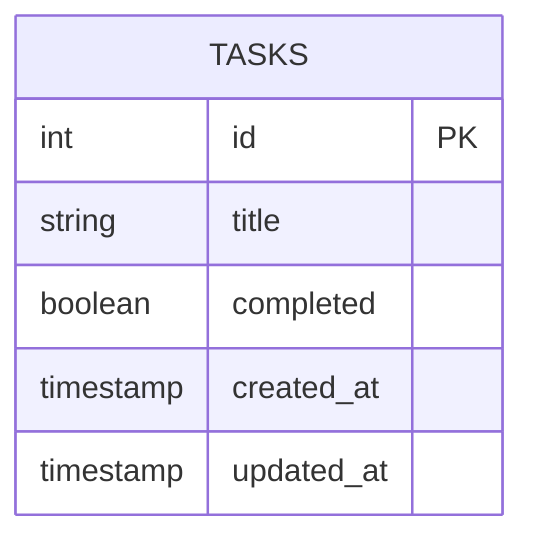

# Todo Application

A simple and efficient Todo application built with Laravel, providing a clean and intuitive interface for managing tasks.

## Project Overview

This Todo application allows users to:
- Create new tasks
- View all tasks
- Mark tasks as completed
- Delete tasks
- Sort tasks by creation date

## System Architecture

### Database Schema


### API Endpoints
```mermaid
graph TD
    A[Client] -->|GET /tasks| B[List Tasks]
    A -->|POST /tasks| C[Create Task]
    A -->|PUT /tasks/{id}| D[Update Task]
    A -->|DELETE /tasks/{id}| E[Delete Task]
```

## Features

- **Task Management**
  - Create new tasks with titles
  - Mark tasks as completed/uncompleted
  - Delete tasks
  - View all tasks in chronological order

- **Data Validation**
  - Title uniqueness validation
  - Required field validation
  - Boolean completion status validation

- **RESTful API**
  - Standard CRUD operations
  - JSON responses
  - Proper HTTP status codes

## Technical Stack

- **Backend**: Laravel 10.x
- **Database**: MySQL
- **API**: RESTful
- **Authentication**: None (Simple CRUD operations)

## Project Structure

```
todo-app/
├── app/
│   ├── Http/
│   │   └── Controllers/
│   │       └── TaskController.php
│   └── Models/
│       └── Task.php
├── database/
│   └── migrations/
│       └── 2024_03_21_000000_create_tasks_table.php
├── routes/
│   └── web.php
└── resources/
    └── views/
```

## API Documentation

### List All Tasks
- **Endpoint**: GET `/tasks`
- **Response**: Array of tasks
- **Example Response**:
```json
[
    {
        "id": 1,
        "title": "Complete project",
        "completed": false,
        "created_at": "2024-04-15T12:00:00.000000Z",
        "updated_at": "2024-04-15T12:00:00.000000Z"
    }
]
```

### Create Task
- **Endpoint**: POST `/tasks`
- **Request Body**:
```json
{
    "title": "New Task"
}
```
- **Response**: Created task object
- **Status Code**: 201 (Created)

### Update Task
- **Endpoint**: PUT `/tasks/{id}`
- **Request Body**:
```json
{
    "completed": true
}
```
- **Response**: Updated task object

### Delete Task
- **Endpoint**: DELETE `/tasks/{id}`
- **Response**: No content
- **Status Code**: 204 (No Content)

## Setup Instructions

1. Clone the repository
2. Install dependencies:
   ```bash
   composer install
   ```
3. Copy `.env.example` to `.env` and configure your database:
   ```bash
   cp .env.example .env
   ```
4. Generate application key:
   ```bash
   php artisan key:generate
   ```
5. Run migrations:
   ```bash
   php artisan migrate
   ```
6. Start the development server:
   ```bash
   php artisan serve
   ```

## Error Handling

The application includes proper error handling for:
- Duplicate task titles
- Missing required fields
- Invalid task IDs
- Invalid completion status

## Contributing

Feel free to submit issues and enhancement requests.

## License

This project is open-sourced software licensed under the [MIT license](https://opensource.org/licenses/MIT).

---

<div align="center">
  <p>Developed with ❤️ by <strong>Kartikeya Sharma</strong></p>
</div>
